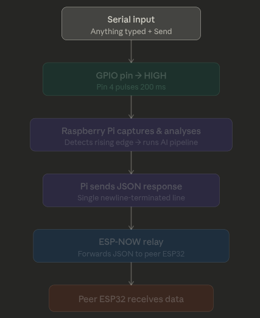
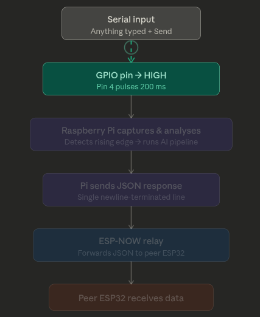
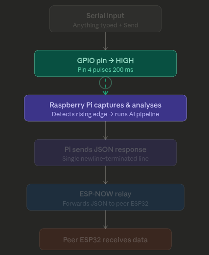
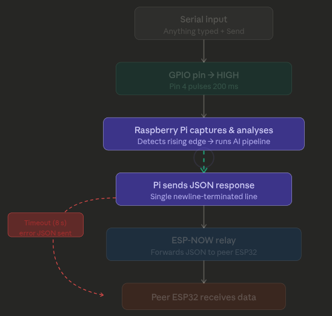
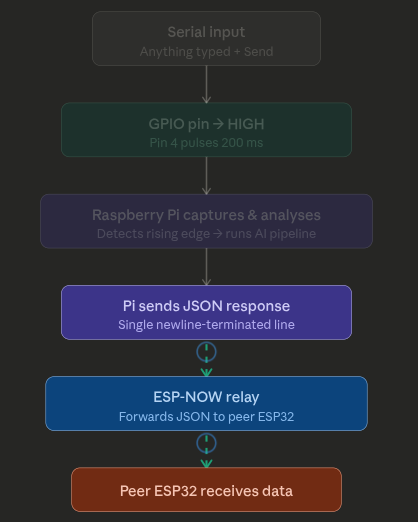

# Microcontroller for triegering the event and sending the alert via ESP-NOW
ESP32 microcontroller is used to trigger the event and send the alert to the user via ESP-NOW. The ESP32 is a powerful microcontroller with built-in Wi-Fi and Bluetooth capabilities, making it ideal for IoT applications. The ESP32 is programmed to listen for a signal from the Raspberry Pi, which is triggered when motion is detected. Once the signal is received, the ESP32 sends an alert to the user via ESP-NOW, which is a low-power, peer-to-peer wireless communication protocol. This allows the user to receive real-time alerts on their device without the need for a constant internet connection.

## Setp 1:
To mimic the motion detection, the seral input is kept as the trigger.

## Step 2:
GPIO pin is set to HIGH when the serial input is received to trigger the event in Raspberry Pi.

## Step 3:
Raspberry Pi receives the signal and starts to capture and analyze the captured image. The predictions are sent to the esp via serial communication.

## Step 4:
ESP waits for the serial data.. if timouts proceeds.

## Step 5:
The received data is parsed and the alert is sent to the user via ESP-NOW.

